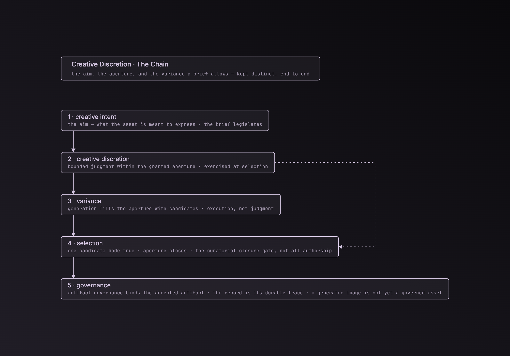

# Creative Discretion Doctrine
### What the architecture preserves: intent → discretion → variance → selection → governance

## Purpose / altitude

This is a high-level doctrine surface. It states, in one place, the **discretion chain** the architecture exists to preserve, and names where each link is detailed elsewhere. It is **doctrine altitude** — not a schema, not a proof-test, not a diagram. The structured definition layer and the architecture docs *implement* this chain; this note states *what they are for*.

It expands [foundational-premises-v1.md](foundational-premises-v1.md) premise 5 ("creative discretion is a structural concern, not a residual") into the full sequence that premise sits inside.

## The discretion chain

The discretion chain keeps five functions distinct across the end-to-end process:

1. **Creative intent** — the aim: what the asset is meant to express. The normative layer, where source of intent lives.
2. **Creative discretion** — the bounded, reviewable judgment that opens and closes the aperture while pursuing the intent. It is *weak* discretion — judgment exercised within standards (intent, constraints, references, output role, decision owner), not freedom from them. The aperture is the permitted variance created by that judgment.
3. **Variance** — the candidate spread produced inside the aperture. The variance-producing operation fills the aperture; it does not evaluate admissible alternatives against the governing standard and bind. (Variance is technical; discretion is normative.)
4. **Selection** — the curatorial closure gate that chooses one realized candidate, closes the aperture, and makes the result **true** to the intent. It is judgment-bearing, but not the whole of authorship.
5. **Governance** — artifact governance: the mechanism that binds the accepted artifact to its claim, permitted use, circulation, approval, and answerability. The governance record — capture, provenance, curator, rationale — is its durable trace and stated basis, not the governance function itself.

Compact: **the brief legislates, the executor executes, the curator adjudicates, governance records.**

## Why the distinctions are load-bearing

- **intent ≠ discretion.** Intent is a direction; the aperture is permitted variance; discretion is the judgment that opens and closes that aperture. Holding intent fixed, the brief can widen or narrow how much room the executor has — and that latitude is assigned to a decision owner. Collapsing intent and discretion into one "creative direction" field is the ambiguity the architecture exists to remove, and the one a machine cannot resolve by inference.
- **discretion ≠ variance production.** Creative discretion may enter before, during, or after realization. The variance-producing operation itself is nonjudgmental. A span is judgment-bearing only when an authorized human or computational decision-maker evaluates admissible alternatives against the governing standard and binds within scope; human presence or authorization alone is insufficient, and current model sampling does not qualify.
- **variance ≠ authorship.** Randomness, sampling, and seeds produce candidates; they do not author. Selection is the curatorial closure gate, not the whole of authorship. Authorship may be attributable through source of intent, bounded discretion, judgment-bearing intervention, selection, and closure. Artifact governance preserves attribution and recourse; it does not create authorship.
- **selection ≠ governance.** Selection closes the aperture and makes the result true to the intent; artifact governance governs the accepted artifact's claim, use, circulation, approval, and answerability. The governance record is the durable trace of that mechanism, not the mechanism itself. A generated image is not automatically a governed asset.

Collapse any two of these and the system can still produce images, but it can no longer say *how the creative work happened* — where authorship lived, what was bounded, who decided.

## AP as a worked instance of a method primitive

This chain is `asset-pipeline-ASK`'s instance of a method-level primitive: **bounded generativity** — *grammar → bounded variance → selection → governed artifact* — defined and owned at [`method-ASK/docs/bounded-generativity.md`](https://github.com/apexSolarKiss/method-ASK/blob/main/docs/bounded-generativity.md), on a legislative / executive / judicial spine (weak discretion in the Dworkin sense). The grounding for that spine lives in the method doc; it is not restated here. The general governance architecture is owned at [`method-ASK/docs/governance.md`](https://github.com/apexSolarKiss/method-ASK/blob/main/docs/governance.md); AP instantiates its artifact-governance subtype and carries a governance record as the durable trace.

`asset-pipeline-ASK` is the **worked instance with governance built out first-class** — the full chain through to the governed-asset record. It is **not** the primitive's owner. The cross-ecology relation (the same structure in `isometric-cubes-ASK`, `mazeASK`, this repo, and generative-AI workflows generally) is recorded at the ecology tier; `isometric-cubes-ASK` and `mazeASK` are **antecedent studies, not dependencies or imports** of this repo.

## Where each link is implemented in this repo

This doctrine names the chain; the surfaces below carry the detail. The doctrine does not duplicate them.

- **the chain, illustrated** — the discretion-chain diagram ([`docs/diagrams/asset-pipeline-ASK_discretion-chain.html`](diagrams/asset-pipeline-ASK_discretion-chain.html)) renders the five links as an ordered sequence. Illustrative orientation only: this doctrine prose is source truth, not the diagram, and the chain is not a runtime schema, validator, grammar, or orchestration flow.

  
- **kinds of information** (intent · inputs · constraints · references · outputs · governance) — the definition-layer ontology (Axis A); see [layer-disambiguation-note-v1.md](layer-disambiguation-note-v1.md) and the ontology diagram ([`docs/diagrams/asset-pipeline-ASK_ontology-tree.html`](diagrams/asset-pipeline-ASK_ontology-tree.html), which draws the intent → discretion relation).
- **creative discretion as structural** — [foundational-premises-v1.md](foundational-premises-v1.md) premise 5.
- **the nine discretion sites + reference-function taxonomy** — [layered-reference-and-discretion-architecture-v1.md](layered-reference-and-discretion-architecture-v1.md).
- **the curation semantic split** (authorship-bearing discretion, variable site, vs governance-bearing curation, always at the seam) and **generated ≠ governed** — [architecture.md](architecture.md).

## Public articulation

The public statement of this model is the article *[Creative Discretion Is Not Creative Intent](https://atomicspacekitten.substack.com/p/creative-discretion-is-not-creative)* (2026-06-06). That is the externally-voiced articulation; this note is the repo-internal, systemic statement of the same chain.

## Boundaries / status

- **Doctrine altitude.** Not schema, proof-test, or diagram. It authorizes nothing operational.
- **AP is a worked instance, not the owner.** `method-ASK` is the primitive's home; cite it as such.
- **Source of intent is human / institutional in the worked AP implementations.** Source of intent, decision ownership, and ultimate recourse remain human / institutional. A computational agent may exercise bounded delegated judgment without thereby becoming the source of intent or owning ultimate recourse; current model sampling fills the aperture and does not author the intent that opened it.
- Starting doctrine the architecture builds on; not re-proved by routine work. It exists so the chain can be cited once, plainly.
